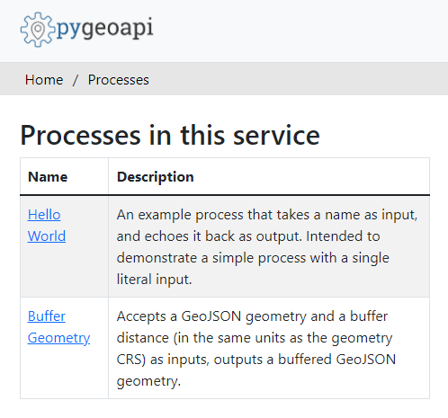
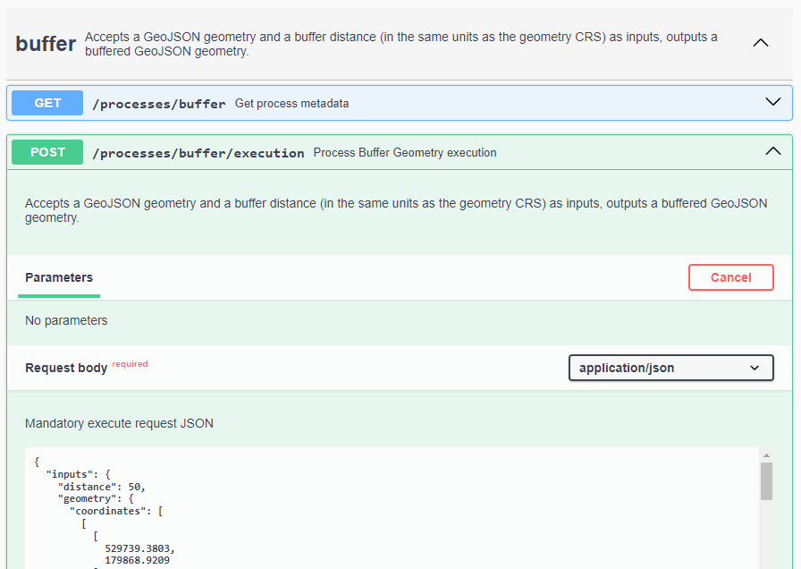

# pygeoapi-plugin-examples

Bare bones package demonstrating packaging a custom OGC Processes API process for use with pygeoapi.

## Install and configuration

Assuming you already have pygeoapi installed within a virtual environment, activate the virtual environment then change to the root of this repository before installing this package as an editable package:
```sh
pip install -e .
```

Configure pygeoapi to make use of the `BufferProcessor` process found at `pygeoapi_plugin_examples/processes/buffer.py`:
```yml
    buffer:
        type: process
        processor:
            name: pygeoapi_plugin_examples.processes.buffer.BufferProcessor
```

Change to the directory that contains your `pygeoapi-config.yml` and update the OpenAPI config to include the new process:

```sh
pygeoapi openapi generate $PYGEOAPI_CONFIG --output-file $PYGEOAPI_OPENAPI
```

on Windows:

```sh
$Env:PYGEOAPI_CONFIG = "F:/Documents/GitHub/pygeoapi/pygeoapi-config.yml"
$Env:PYGEOAPI_OPENAPI = "F:/Documents/GitHub/pygeoapi/example-openapi.yml"
pygeoapi openapi generate $Env:PYGEOAPI_CONFIG --output-file $Env:PYGEOAPI_OPENAPI
```


## Usage

After starting the server, you should see the buffer processor in http://localhost:5000/processes?f=html




### Swagger

You can test the process via Swagger UI at http://localhost:5000/openapi?f=html#/buffer/executeBufferJob 



### Example execution request

Execute the `buffer` process via `curl`:
```sh
curl -X POST -H "Content-Type: application/json" -d '{"inputs": {"distance": 5, "geometry": {"type": "Polygon", "coordinates": [[[529739.3803, 179868.9209], [529778.6271, 179914.7657], [529831.3243, 179939.7011], [529838.0743, 179941.8764], [529844.796, 179945.1638], [529861.7705, 179946.71], [529875.2509, 179932.8113], [529876.7534, 179903.9186], [529883.2889, 179898.188], [529880.6071, 179888.9951], [529874.812, 179882.0594], [529849.0582, 179887.0765], [529833.6703, 179877.7816], [529814.4507, 179874.3978], [529813.628, 179871.2611], [529811.5773, 179869.9847], [529808.2886, 179868.2317], [529800.1866, 179875.4802], [529770.1846, 179867.3703], [529762.9924, 179866.1852], [529754.3972, 179857.3978], [529753.6511, 179851.2587], [529743.2636, 179850.1034], [529739.3803, 179868.9209]]]}}}' "http://localhost:5000/processes/buffer/execution?f=json&"
```
On Windows:
```sh
curl.exe --% -X POST "http://localhost:5000/processes/buffer/execution?f=json&" -H "Content-Type: application/json" -d "{\"inputs\": {\"distance\": 5, \"geometry\": {\"type\": \"Polygon\", \"coordinates\": [[[529739.3803, 179868.9209], [529778.6271, 179914.7657], [529831.3243, 179939.7011], [529838.0743, 179941.8764], [529844.796, 179945.1638], [529861.7705, 179946.71], [529875.2509, 179932.8113], [529876.7534, 179903.9186], [529883.2889, 179898.188], [529880.6071, 179888.9951], [529874.812, 179882.0594], [529849.0582, 179887.0765], [529833.6703, 179877.7816], [529814.4507, 179874.3978], [529813.628, 179871.2611], [529811.5773, 179869.9847], [529808.2886, 179868.2317], [529800.1866, 179875.4802], [529770.1846, 179867.3703], [529762.9924, 179866.1852], [529754.3972, 179857.3978], [529753.6511, 179851.2587], [529743.2636, 179850.1034], [529739.3803, 179868.9209]]]}}}"
```